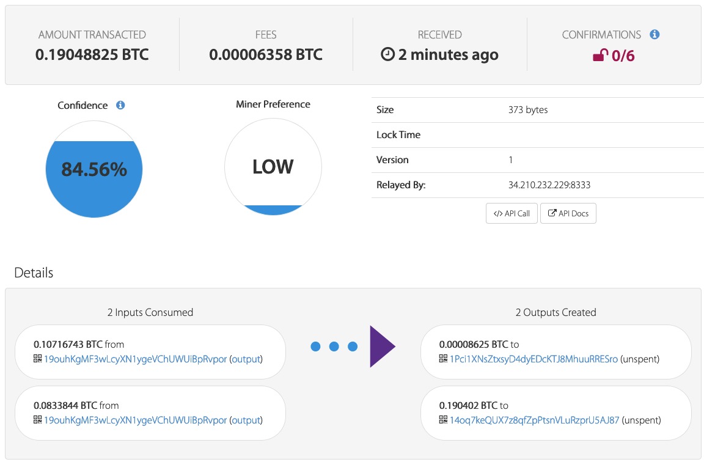

# Visualizing UTXOs

In this activity, you will navigate through several transactions in a Bitcoin block explorer,
and decipher the different key parts, including the UTXOs.

## Instructions

* Navigate to the [latest BTC transactions on Blockcypher](https://live.blockcypher.com/btc/).

* Click on a transaction hash in the `Latest Transactions` section.

You should see a transaction visualized like the following:

* Identify the following fields in the transaction:

  * Transaction Inputs

      tb1qz8k4jn88hug7zlg6etpj226s7x5yeksj0

  * Transaction Outputs (UTXOs)

      tb1q4jnaqh7kqkdl8etpuex96c0ngy8my2

      mnLVoPaQNgk7HBGJGo6pCL3mgCYNvXP

  * Transaction Fee
      
      0.00014688 BTC

 * Identify the UTXO that matches the `Amount Transacted` field at the top.
  This is the new Unspent Transaction Output that can be spent by the destination address.

      9.42019056 BTC to
      tb1q4jnaqh7kqkdl8etpuex96c0ngy8my2

* Identify the address that the funds are ultimately being sent to.

      mnLVoPaQNgk7HBGJGo6pCL3mgCYNvXPa

* Repeat these steps with another transaction. See if you can decipher what is going on!

## Hints

* The destination address should be in the same bubble as the UTXO that matches the `Amount Transacted`.
